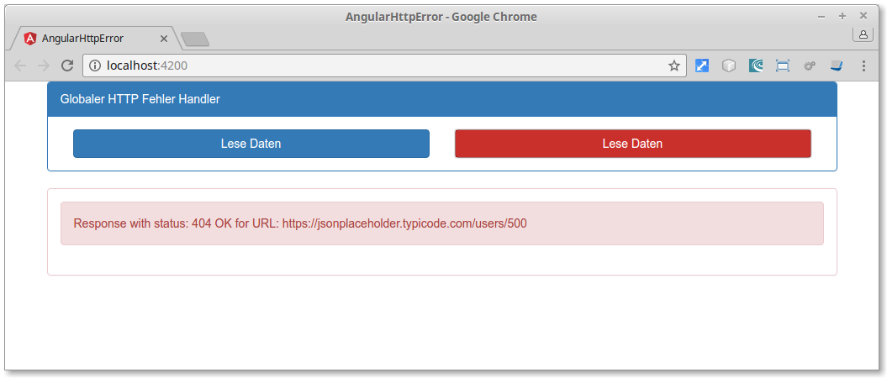

# Angular, globaler HTTP Error Handler

Demo-Projekt zum Blog 
[GEDOPLAN](https://javaeeblog.wordpress.com/?p=3809)


Thema: Angular HTTP Error Handler



## Development server

Starten per `ng serve` URL: `http://localhost:4200/`. 

```
by GEDOPLAN, Dominik Mathmann
```
